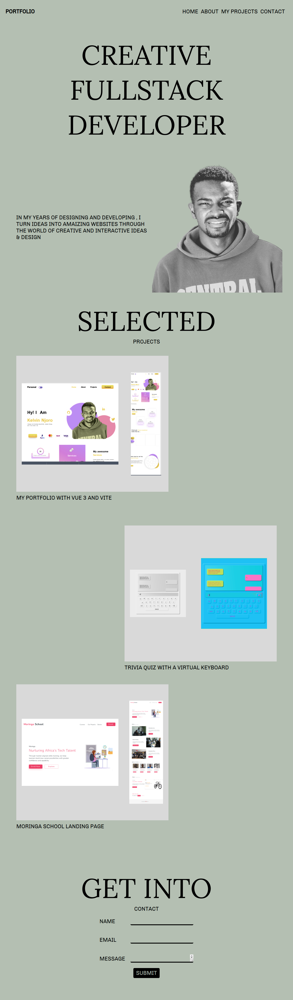
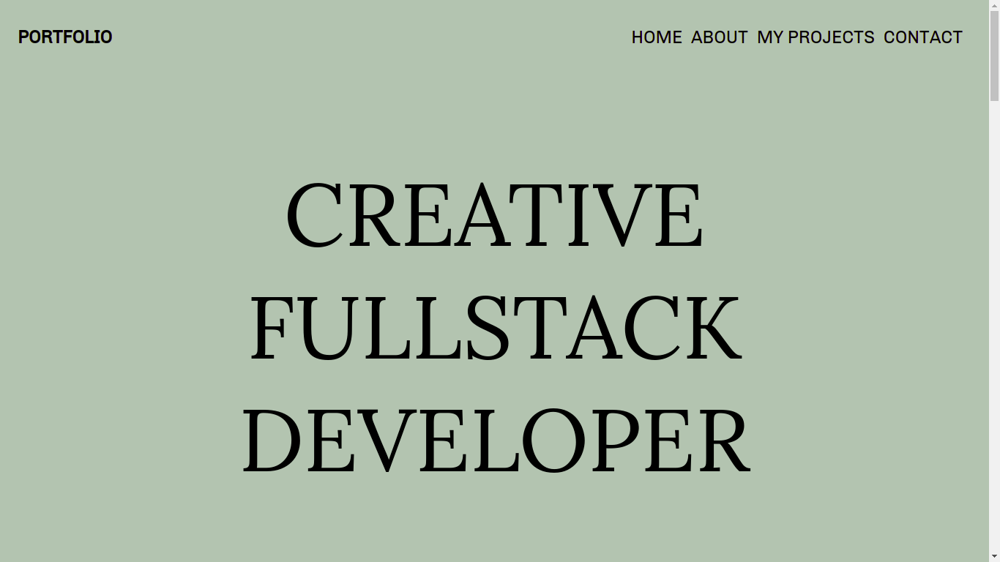

# Portfolio page

***

## Creator :man_technologist:

This Portfolio Page was created and is maintained by **Kelvin Njoro**
* [Twitter](https://twitter.com/kelvinprincipal/)
* [Github](https://github.com/principalkelvo/)
* [Facebook](https://facebook.com/principal.kelvin1/)

## Design

### Full Preview

### Hero Preview

For full design click [image](https://www.figma.com/file/U6Ru1E77yFuXUlK0Wbg8Le/Minimal-Portfolio?node-id=0%3A1)

## Description

This is my Portfolio. The main purpose of this respisotory is to give the user a better Ui and UX experience while viewing my portfolio. This project is done by using HTML, CSS and JS only to create a cool Portfolio page. It is a fully developed light mode for all gadgets

### Contains

* A display -
  * with the slogan
  * and buttons
* My Projects Sections
* Contact Me Section
  * Build with :smiling_face_with_three_hearts:

### Features

> - Static Html page - no fancy hosting needed (Github pages does it for free)
> - Light source code - fast to load
> - Beautiful interface - compatible with all desktops and with a beautiful and pleasant interface.
> - Smooth Scroll - added a back to top scroll btn
> - Dark mode- still under construction
> - Responsive - compatible with all gadgets.

### Requirements

* Access to  a computer or any other gadget
* Access to internet

### Setup and installation

To view the website,

* Click [Here](https://principalkelvo.github.io/portfolio-with-html-css-and-js/) **or**
* Copy the link https://principalkelvo.github.io/portfolio-with-html-css-and-js/ paste to your browser and load it

### Built with

* HTML - which was used to develop the structure off the pages.
* CSS - which was used to style the User Interface.
* JS - which was used to create a great interaction with the User Interface.

## Bugs and Issues

Have a bug or issue? Open a new issue here on Github

### Known Bugs

* There are no known bugs

## Image Attribution

Images owned by Kelvin Njoro

Free for personal use with attribution

## Credits

* __[Google Fonts](https://fonts.google.com/)__ - Chivo and Lora
* __[Font Awesome](https://fontawesome.com/)__

## License

Use it freely but please do not republish, distribute or sell

Thats it! Simple, clean and smooth!
